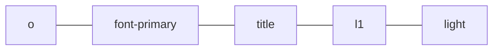
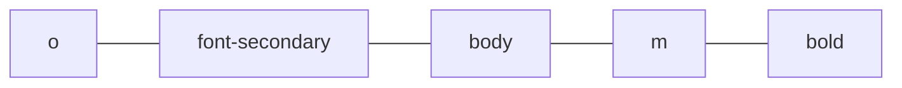

# Base project for web pages

This template uses the BEMIT methodology complemented with SASS.

The main.css.map file is automatically generated in:
> assets / main.css


# Fonts

The font sizes are described in the following table:


|SelectFont |Priority |Level  |Abbreviation|Size in PX  |Change Weight in: |
|--|---|--|----|--|--|
| ***/_o-font.scss line #2***|| | | | ***/_o-font.scss line #51***|
|Primary| Title|Level 1 |l1|60px          | light
|Primary| Title|Level 2 |l2|48px   |light
|Primary| Title|Level 3 |l3|32px|light
|Primary|Title|Level 4 |l4|22px|light
|Primary|Body|Level M |m|18px|light
|Primary|Body|Level S |s|16px|light
|Primary|Body|Level XS |xs|14px|light
|Primary|Body|Level XXS |xss|12px|light

## **Example Nomeclature Font:**

###   ⋅  Example 1



*Result:*
```html
o-font-primary-title-l1--light
```
---

### ⋅ Example 2




*Result:*
```
o-font-secondary-body-m--bold
```

# Media Queries

These media queries are located up to an; Iphone 5 = **320px wide**.
  It is important to consider that the media queries are for **desktop first**.

|Break Points | PX |
|--|---|
|XL| 1200|
|LG| 1024|
|MD| 768|
|SM|576|
|XS|480|
|XXS|320|